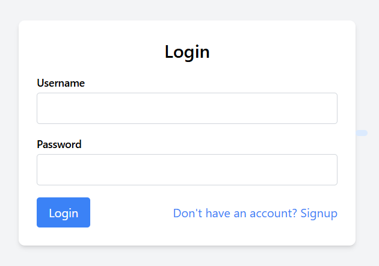
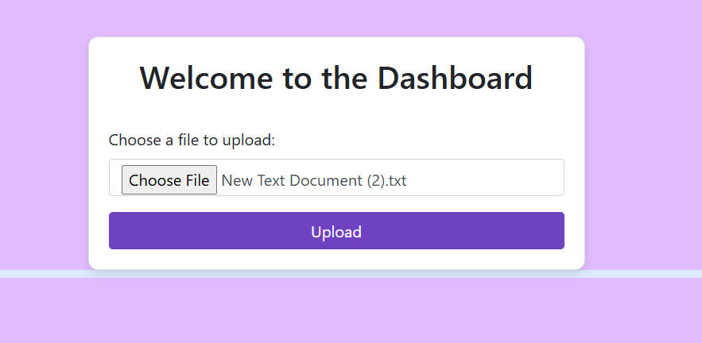
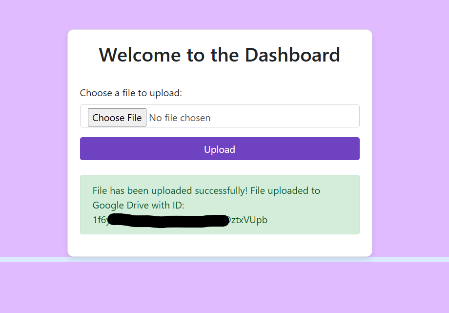

# File Redirection App

This project is a web-based file redirection application that allows users to upload files to Google Drive using the Google Drive API.

## Features
- User authentication (signup & login system)
- File upload to local storage and Google Drive
- Secure password storage using hashing
- Responsive UI with Bootstrap and TailwindCSS

## Installation

### Prerequisites
- PHP 7.x or later
- MySQL database
- Composer
- Google Cloud service account with Google Drive API enabled

### Setup Instructions
1. Clone this repository:
   ```sh
   git clone https://github.com/lukeperry/file-redirection.git
   cd file-redirection
   ```
2. Install dependencies:
   ```sh
   composer install
   ```
3. Configure database:
   - Create a MySQL database (`db_file_redirection`).
   - Import `database.sql` (if provided).
   - Update database credentials in `index.php` and `dashboard.php`.
4. Set up Google Drive API:
   - Place your `service-account.json` file in the project root.
   - Ensure `cacert.pem` is present in the project root (used for SSL verification).
   - Update `dashboard.php` with the correct Google Drive folder ID.
5. Start the database (wampp/xampp)
6. Start the local server:
   ```sh
   php -S localhost:8000
   ```
7. Open `http://localhost:8000` in your browser.

## Usage
- Signup/Login
- Upload files using the dashboard
- Files will be stored in Google Drive under the specified folder

## Screenshots

  #### Login


  #### Dashboard


  #### File Uploaded



## Security Considerations
- Passwords are securely hashed.
- Service account credentials (`service-account.json`) should be kept private.
- Ensure proper access control for Google Drive.

## License
MIT License
